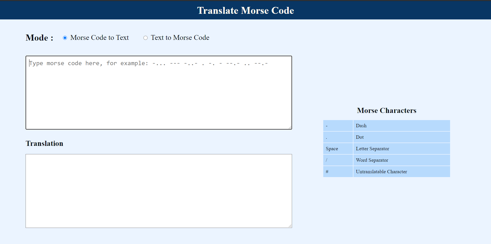
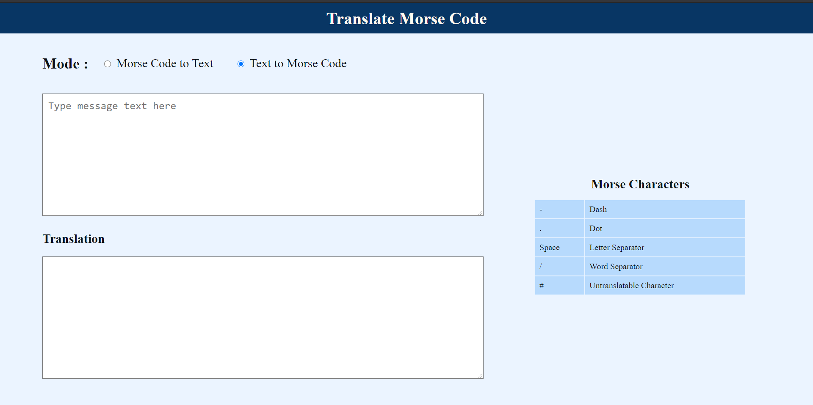
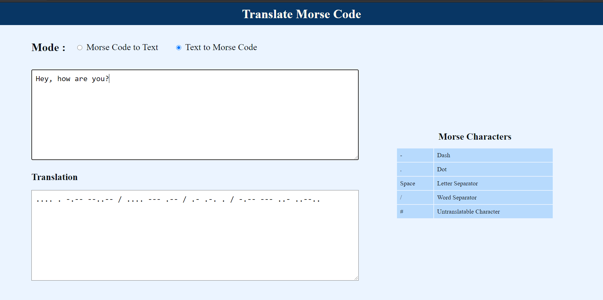
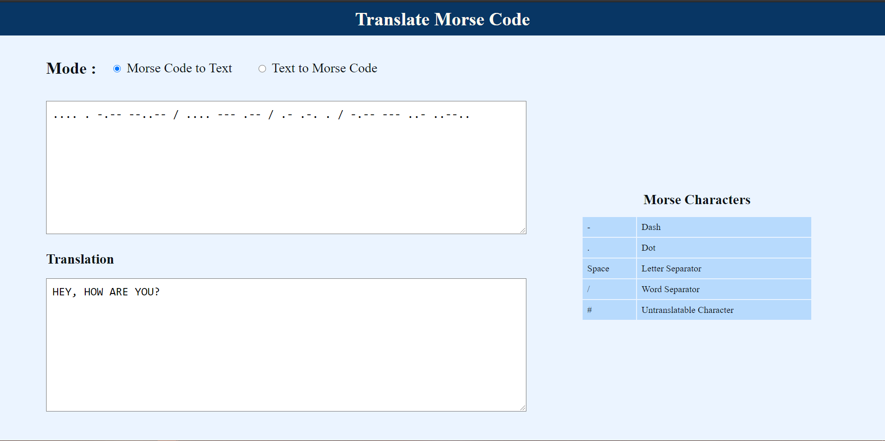

# Morse Code Translator

> Morse code is a method used in telecommunication to encode text characters as standardized sequences of two different signal durations, called dots and dashes or dits and dahs. Morse code is named after Samuel Morse, an inventor of the telegraph.

A web app to translate Morse Code to Text and Text to Morse Code.
Used tech stack - **HTML**, **CSS**, and **JS**.

We can choose our desired mode from the radio button and input the text in the textarea. The translated output will be displayed in the textarea below it.

### Screenshots:-

&nbsp;&nbsp;&nbsp;&nbsp;
&nbsp;&nbsp;&nbsp;&nbsp;
